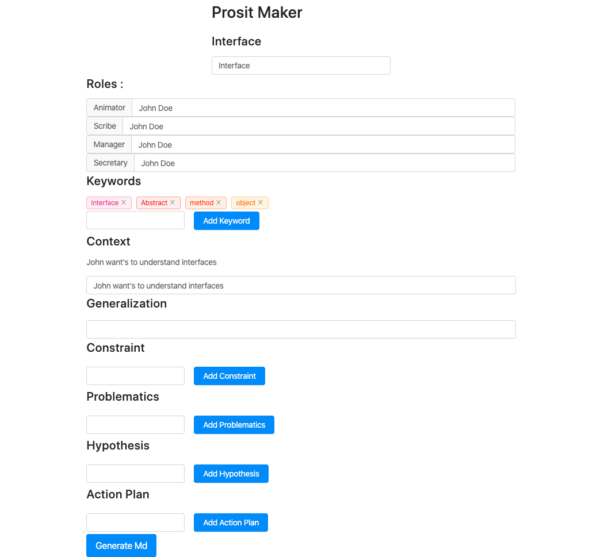

# Prosit maker

This is my prosit maker.



## What is a Prosit

Prosit is the name we give to the lesson in my school, we are free to write our courses as we wish and I have decided to use the markdown syntax to increase productivity.

## How it works

The core of the application is developed with reactJS.

The project is not yet online. If you want to use it:

```bash
    # clone the repo
    git clone https://github.com/Maxia51/prosit-maker.git
    cd prosit-maker

    # install the dependencies
    npm install

    # run server (3000 if port is available)
    npm start
```

It will generate prosit in `markdown` file.

if you want to have it in `docx` :

```bash
    # Using pandoc lib to convert md to word
    pandoc -s prositAller.md -f markdown -t docx -o prositAller.docx
```
